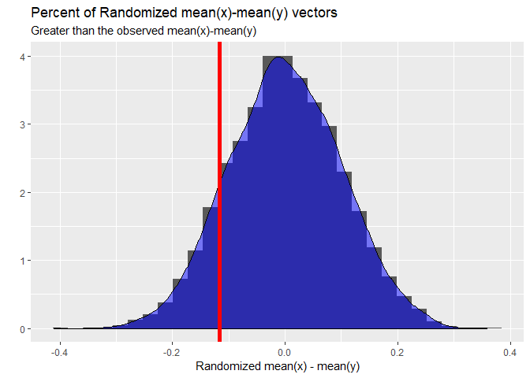

<!-- README.md is generated from README.Rmd. Please edit that file -->
turnR
=====

<!-- badges: start -->
<!-- badges: end -->
The turnR package contains several functions that I find useful. Feel free to use them and recomended changes and updates as you desire. Thanks!

Installation
------------

You can install the development version from [GitHub](https://github.com/) with:

``` r
# install.packages("devtools")
devtools::install_github("dusty-turner/turnR")
```

Example `theme_turnR`
---------------------

This is an example which shows you how to use the `theme_turnR` function for ggplot2.

``` r
library(turnR)
data("diamonds")
diamonds %>%
  ggplot(aes(x=carat,y=price,color=cut,fill=cut)) +
  geom_point() +
  labs(title = "Diamonds Data") +
  theme_turnR()
```


Example 2 `theme_turnR_f`
-------------------------

This is an example which shows you how to use the `theme_turnR_f` function for ggplot2.

``` r
library(turnR)
data("diamonds")
diamonds %>%
  ggplot(aes(x=cut,y=price,color=cut,fill=cut)) +
  geom_violin() +
  labs(title = "Diamonds Data") +
  facet_wrap(~clarity) +
  theme_turnR_f()
```


Example 3 `randtest` and `randtestvis`
--------------------------------------

``` r
set.seed(256)
x=rnorm(100,1,0)
y=rnorm(100,1.1,1)
rt = randtest(x,y,fun = mean, reps = 10000)
rt[2] 
#> [[1]]
#>    p.x.less.than.y p.x.greater.than.y    two.sided.p.x=y 
#>             0.8756             0.1244             0.2536
rt[3] 
#> [[1]]
#> [1] 0.1159779
randtestviz(x,y,fun = mean, reps = 10000)
#> `stat_bin()` using `bins = 30`. Pick better value with `binwidth`.
```



Cats
----

Oh, and everyone likes cats

``` r
mycat(CatName = "BeatNavy")
#> Your Cat's Name is BeatNavy 
#>    /\_/\
#>   ( o.o )
#>    > ^ <
#>   (     )
#>    ^   ^ 
#>    _____
```
